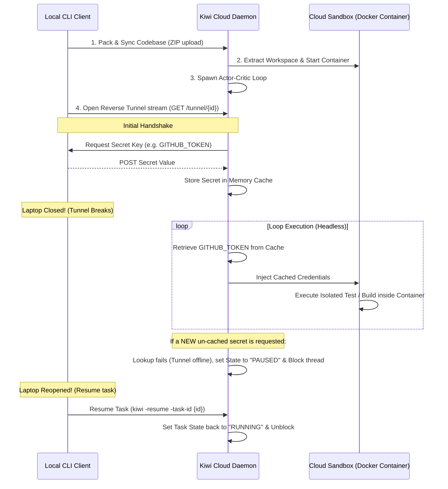

# Kiwi: The Secure Agentic Control Plane

Kiwi is an enterprise-ready secure execution engine that runs autonomous developer loops (TDD Actor-Critic alignment) in the cloud while pulling required secrets dynamically and securely from the local machine over a reverse tunnel.

With Kiwi, you can trigger complex, long-running agent workflows in the cloud sandbox and **safely close your laptop**. Once a credential (like a GitHub OAuth token or database keys) is resolved, it is cached securely in-memory on the cloud daemon, allowing the loop to continue executing to completion even if your laptop is closed and the tunnel drops.

---

## High-Level Architecture



---

## Core Features

1.  **Actor-Critic Alignment Loop**: A test-driven development (TDD) controller that iteratively edits code, evaluates compiler/test stdout in the sandbox, and refines fixes.
2.  **Docker Container Sandboxing**: Isolates all untrusted code modification, compilation, and test execution inside dedicated Docker containers (`golang:1.21-alpine`), securing the server host.
3.  **Reverse Credential Tunneling**: Eliminates the need to persist long-lived AWS, GitHub, or GCP API credentials on cloud sandbox hosts.
4.  **Credentials Caching**: Allows developers to close their laptops immediately after the loop starts. The cloud sandbox uses cached credentials to execute the remaining iterations.
5.  **Headless Laptop Pause & Resume**: Complete offline resilience. If an un-cached secret is needed while the laptop is closed, execution statefully pauses and resumes when the laptop is opened.
6.  **Loop Safety & Budgeting**:
    *   **Circuit Breaker**: Detects infinite recursive loop states by tracking duplicate compiler stdout patterns (stops after 3 identical failures).
    *   **Budget Caps**: Sets strict cost controls per task to prevent budget drainage.
7.  **Interactive Kanban Dashboard**: Embedded dark-themed dashboard featuring status cards, live polling, log filters, and a real-time console log viewer.
8.  **Crash-Safe Restart Recovery**: On boot the daemon reconciles tasks left mid-flight by a previous lifetime — if the task's sandbox survived on disk it re-launches the loop (which resumes or statefully pauses awaiting a client reconnect); otherwise it marks the task `FAILED` with an "interrupted by restart" note. No more zombie `RUNNING` rows.
9.  **Idempotent Submission**: `POST /tasks` honors an optional `Idempotency-Key` header (client `-idempotency-key` flag). Retrying a submission with the same key returns the original task instead of creating a duplicate task, sandbox, and LLM bill.

---

## Interactive Kanban Dashboard


---

## Getting Started

### Prerequisites
*   Go 1.21 or higher
*   macOS or Linux
*   Docker Desktop (for container sandboxing)

### Quick Setup

1.  **Clone & Build**:
    ```bash
    # Build and sign the binaries
    go build -ldflags="-linkmode=external" -o kiwi cmd/kiwi/main.go && codesign -s - -f ./kiwi
    go build -ldflags="-linkmode=external" -o kiwid cmd/kiwid/main.go && codesign -s - -f ./kiwid
    ```

2.  **Start the Kiwi Server Daemon**:
    Configure the auth token and enable Docker sandboxing:
    ```bash
    export USE_DOCKER="true"
    export KIWI_SERVER_TOKEN="production-secure-token-9999"
    ./kiwid -addr :8080 -db kiwi.db
    ```

3.  **Deploy a Task**:
    Set up a local `secrets.json` file in your workspace directory (or export env vars) and execute:
    ```bash
    # Create secrets (looked up secrets.json first, then environment variables)
    echo '{"GITHUB_TOKEN": "real-token-value-here"}' > secrets.json

    # Run loop
    ./kiwi -token "production-secure-token-9999" -task "Fix division by zero in Divide()" -file demo_project/math_utils.go -test-cmd "go test ./demo_project/..."
    ```

    The client packages the working directory (skipping `.git`, binaries, and `secrets.json`), submits the task, serves the reverse tunnel so the daemon can pull secrets on demand, streams live logs, and — on success — downloads the fixed codebase to **`kiwi-fix-<task-id>.zip`** without ever overwriting your local files.

    **Client flags:** `-server` (daemon URL, default `http://localhost:8080`), `-token`, `-task`, `-file` (relative to `-dir`), `-test-cmd`, `-dir` (dir to zip, default `.`), `-secrets` (default `secrets.json`), `-interval` (poll cadence, default `2s`), and `-resume -task-id <id>` to reconnect to a paused task.

4.  **Access the Dashboard**:
    The dashboard frontend is fully decoupled into the `/web/` directory. You can serve it using a local static file server or open it directly in a browser:
    ```bash
    # Open index.html directly in a browser
    open web/index.html

    # Or serve static files on port 3000
    npx -y serve -l 3000 web/
    ```
    *Note: Configure the Kiwi Daemon URL (e.g. `http://localhost:8080`) and your Bearer Authorization Token in the Settings panel in the upper-right corner of the dashboard (persists in `localStorage`).*

---

## Context for AI Coding Assistants (CLAUDE.md)
For instructions on style conventions, packaging rules, and workspace troubleshooting, please refer to the [CLAUDE.md](file:///Users/karn/Desktop/workspace/steelwing/CLAUDE.md) file.
