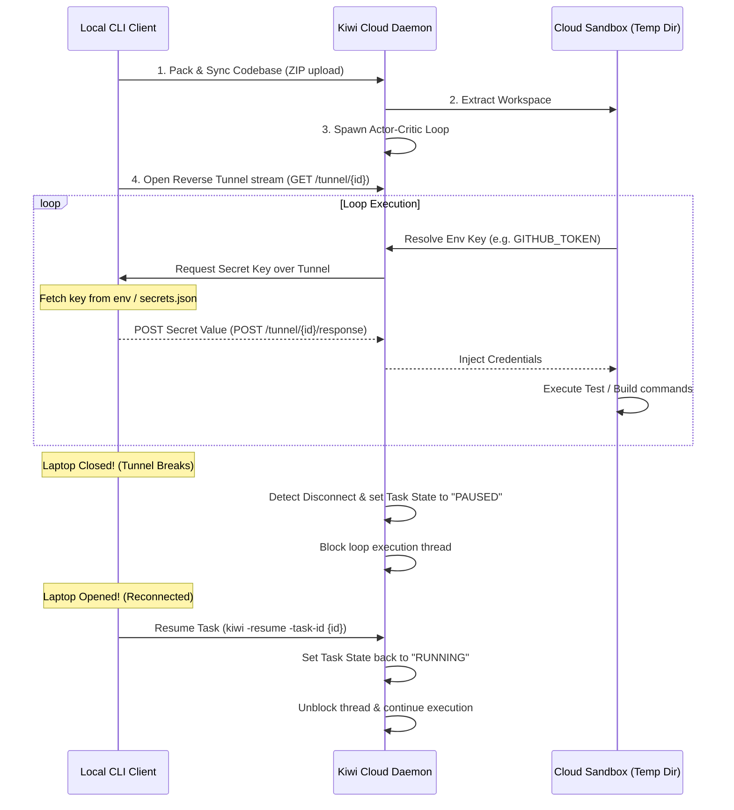

# Kiwi: The Secure Agentic Control Plane

Kiwi is an enterprise-ready secure execution engine that runs autonomous developer loops (TDD Actor-Critic alignment) in the cloud while pulling required secrets dynamically and securely from the local machine over a reverse tunnel.

With Kiwi, you can trigger complex, long-running agent workflows in the cloud sandbox and **safely close your laptop**. If a step requires a developer credential (like a GitHub OAuth token, database credentials, or API keys), the execution statefully pauses, wait for you to reconnect, and resumes once the tunnel is active.

---

## High-Level Architecture



---

## Core Features

1.  **Actor-Critic Alignment Loop**: A test-driven development (TDD) controller that iteratively edits code, evaluates compiler/test stdout in the sandbox, and refines fixes.
2.  **Reverse Credential Tunneling**: Eliminates the need to persist long-lived AWS, GitHub, or GCP API credentials on cloud sandbox hosts.
3.  **Headless Laptop Pause & Resume**: Complete offline resilience. Execution freezes statefully when a laptop disconnects and resumes when it reconnects.
4.  **Loop Safety & Budgeting**: Built-in protection gates:
    *   **Circuit Breaker**: Detects infinite recursive loop states by tracking duplicate compiler stdout patterns.
    *   **Budget Caps**: Sets strict cost controls per task (runs at simulated token pricing) to prevent budget drainage.
5.  **Interactive Kanban Dashboard**: Embedded dark-themed dashboard featuring status cards, live polling, log filters, and a real-time console log viewer.

---

## Interactive Kanban Dashboard


---

## Getting Started

### Prerequisites
*   Go 1.21 or higher
*   macOS ( Tahoe/darwin ARM64 ) or Linux

### Quick Setup

1.  **Clone & Build**:
    ```bash
    # Build and sign the binaries
    go build -ldflags="-linkmode=external" -o kiwi cmd/kiwi/main.go && codesign -s - -f ./kiwi
    go build -ldflags="-linkmode=external" -o kiwid cmd/kiwid/main.go && codesign -s - -f ./kiwid
    ```

2.  **Start the Kiwi Server Daemon**:
    ```bash
    ./kiwid -addr :8080 -db kiwi.db
    ```

3.  **Deploy a Task**:
    Set up a local `secrets.json` file in your workspace directory (or export env vars) and execute:
    ```bash
    # Create secrets
    echo '{"GITHUB_TOKEN": "real-token-value-here"}' > secrets.json

    # Run loop
    ./kiwi -task "Fix division by zero in Divide()" -file demo_project/math_utils.go -test-cmd "go test ./demo_project/..."
    ```

4.  **Access the Dashboard**:
    Open [http://localhost:8080](http://localhost:8080) in your web browser.

---

## Context for AI Coding Assistants (CLAUDE.md)
For instructions on style conventions, packaging rules, and workspace troubleshooting, please refer to the [CLAUDE.md](file:///Users/karn/Desktop/workspace/steelwing/CLAUDE.md) file.
