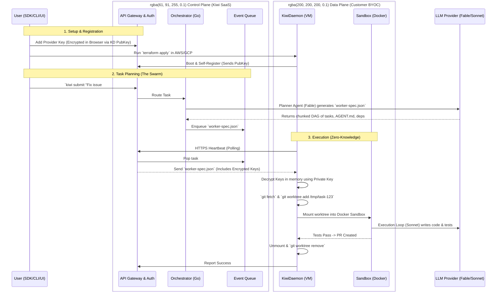

# Kiwi Architecture Design (Startup-First BYOC)

This document outlines the architectural blueprint for the Kiwi AI Execution Engine, emphasizing a startup-friendly, BYOC (Bring Your Own Cloud) model, highly parallelized Swarm capabilities, and zero-knowledge security.

## Core Tenets
1.  **Decoupled Control & Data Planes:** Kiwi SaaS handles orchestration (planning); customer clouds handle execution (building).
2.  **Zero-Knowledge Credentials:** API Keys and Git tokens are encrypted at the edge and never stored in plaintext by the SaaS.
3.  **Git Worktree Caching:** Utilize `git worktree` for instant repository cloning inside the Data Plane (bounded LFU eviction is a planned follow-up).
4.  **CLI & SDK Native:** Emphasize programmatic integration over heavy UI dashboards.

---

## 1. High-Level Architecture Flow

The architecture is split into two halves: the SaaS Control Plane and the Customer's Data Plane (BYOC).

---

## 2. The Components

### Control Plane (SaaS)
*   **API Gateway & Auth:** Handles user authentication, team RBAC, and exposes the SDK/CLI/Webhook endpoints.
*   **Orchestrator (`kiwi-api` in Go):** Houses the Planner logic. It uses frontier models (like Fable) to break a high-level task down into a DAG (Directed Acyclic Graph) of smaller jobs (`worker-spec.json`).
*   **Event Queue:** A highly scalable message broker (e.g., Redis Streams or SQS) holding pending worker specs for the Daemons to pick up.

### Data Plane (BYOC)
*   **KiwiDaemon (KD):** A lightweight Go binary running on a dedicated VM (EC2/Compute Engine) inside the customer's VPC. It is responsible for polling the queue, managing the repo cache, decrypting secrets in memory, and spawning sandboxes.
*   **The Sandbox:** Ephemeral, isolated environments (Docker containers or Firecracker microVMs) where the actual Worker agents (using cheaper models like Sonnet) execute code, run shell commands, and verify test suites.

### Integration Layer
*   **The SDK:** A Node/Python library allowing programmatic task submission (e.g., `kiwi.spawn()`).
*   **CLI (`kiwi`):** Local developer tool for submitting tasks, streaming logs, and running `kiwi claude` (wrapping local AI terminals to offload large refactors to the Swarm).
*   **Headless Connectors:** Native webhooks for Linear, GitHub, and Slack to trigger the Swarm without opening a dashboard.

---

## 3. Deep Dives

### Zero-Knowledge Credential Sharing
For customer-provided credentials, the SaaS database only stores ciphertext.
1. `KiwiDaemon` boots and generates an **X25519** encryption keypair (for receiving sealed credentials) and an **Ed25519** signing keypair (its identity for authenticating heartbeats). The private keys stay on the VM disk; both public keys are sent to the Control Plane.
2. When the user configures API keys or Git tokens, they are sealed to the KD's **X25519** public key before storage (X25519/ECDH is encryption-capable; Ed25519 is a signature key and cannot encrypt).
3. During the daemon heartbeat, the Control Plane sends the ciphertext. The daemon decrypts it in-memory.

### Lightning-Fast Sandbox Provisioning
We eliminate the network latency of cloning large mono-repos.
1. `KiwiDaemon` maintains a base `bare` clone on the VM.
2. For each task, it runs `git worktree add /tmp/task-123 main` (which takes milliseconds).
3. The Sandbox container mounts `-v /tmp/task-123:/workspace`.
4. When finished, the worktree is destroyed.
