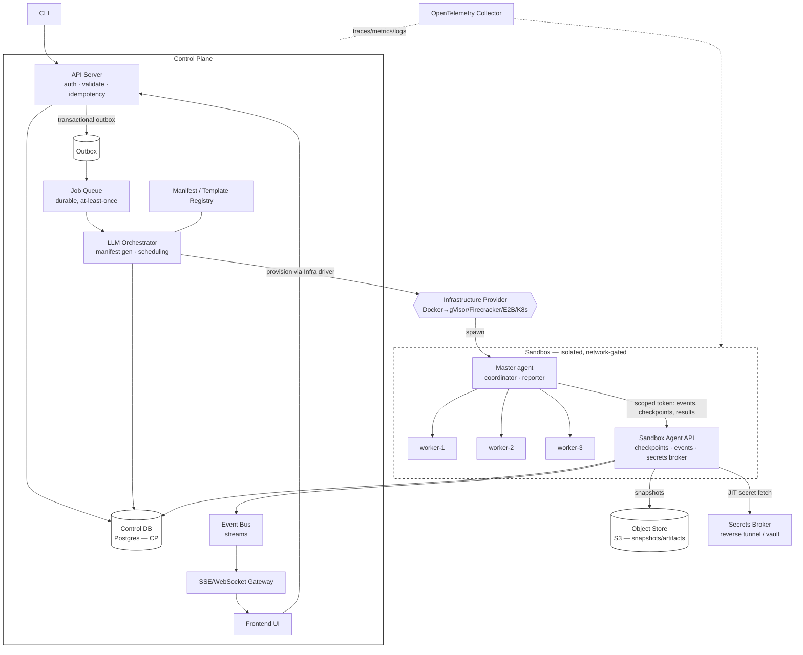

# RFC: Distributed Agentic Execution Platform

**Status:** Draft for review
**Date:** 2026-07-10
**Authors:** Platform Architecture (pairing session)
**Reviewers:** TBD
**Scope:** Greenfield target-state architecture (re-architecture acceptable; no migration path required)

---

## 1. Executive Summary & Goals

### 1.1 What we are building
A distributed execution platform that orchestrates **LLM agent workflows** inside **isolated sandboxes**. A user submits a job (a goal + a workflow/template); the platform compiles it into an immutable **manifest**, schedules an isolated sandbox running a **Master–Worker** agent topology, streams deep per-step telemetry, and durably checkpoints state so any run can be resumed or rolled back deterministically. Secrets are injected just-in-time and never persisted in the sandbox.

### 1.2 Why
Agent workflows are long-running, non-deterministic, side-effecting, and expensive. Running them ad-hoc gives no isolation, no cost governance, no resumability, and no observability. This platform makes agent execution **safe (isolation + secret hygiene), reliable (idempotent, checkpointed, resumable), governable (multi-tenant quotas + cost), and legible (per-step tracing)** — the control plane for running agents in production.

### 1.3 Goals
- **G1 — Isolation:** every job runs in a sandbox with no lateral access to the control plane, other tenants, or undeclared network egress.
- **G2 — Resiliency:** idempotent submission and per-step execution; deterministic checkpoint/rollback; automatic recovery of interrupted runs.
- **G3 — Observability:** end-to-end distributed tracing from CLI → control plane → sandbox → individual agent steps; live streaming + durable history.
- **G4 — Extensibility & Bring-Your-Own-LLM:** pluggable **Infrastructure** providers (Docker → gVisor/Firecracker/E2B/K8s) and **LLM** providers — **Anthropic, Codex, Google Gemini, or any compatible endpoint** — with per-org **bring-your-own-key** and per-role model selection; manifests producible by defaults, user templates, or 3rd-party plugins.
- **G5 — Governance:** strong per-tenant quotas (concurrency, budget, disk, timeout) and cost accounting.

### 1.4 Non-Goals (v1)
- Multi-region active/active control plane (single-region HA at v1).
- Dynamic mid-run worker autoscaling (worker fan-out is fixed per manifest at v1).
- A general-purpose FaaS; this is agent-workflow-specific.
- Human-in-the-loop approval UX beyond a defined hook (interface specified, UX deferred).

### 1.5 Success metrics (SLOs)
| Metric | Target |
|---|---|
| Submit → sandbox `running` scheduling latency | p95 < 5s |
| Control-plane API availability | 99.9% |
| Job state correctness (no double-scheduling) | 100% (strong consistency invariant) |
| Recovery of interrupted runs on control-plane restart | 100% resumed or explicitly failed (no zombies) |
| Checkpoint overhead | < 5% of job wall-clock |
| Trace coverage (steps emitting spans) | 100% of agent turns + tool calls |

### 1.6 Assumptions (from interrogation; treat as ratified defaults)
- **Scale:** launch ~50 concurrent sandboxes / low-thousands queued → 5k concurrent / 100k queued at 12-month horizon.
- **Job duration:** seconds-to-minutes typical, up to ~30 min p99.
- **Tenancy:** multi-tenant; 1 master + ≤ 8 workers per sandbox; fan-out static per manifest at v1.
- **Consistency:** control-plane store is **CP (strongly consistent)**; DB is the source of truth; queue handoff is exactly-once via transactional outbox.
- **Checkpointing:** event log + object-store workspace snapshots; side-effecting tools gated by an idempotency ledger.
- **Isolation:** Docker + `--network=none` + resource limits at v1, behind a pluggable Infrastructure interface.
- **Secrets:** just-in-time injection (reverse tunnel / broker); never at rest in the sandbox.

---

## 2. System Architecture

### 2.1 High-level diagram



### 2.2 Request lifecycle (happy path)
1. **Submit.** CLI/FE calls `POST /jobs` with a workflow ref + inputs + an `Idempotency-Key`. API server authenticates, authorizes against the tenant, validates, and enforces quota.
2. **Persist + enqueue (atomic).** In one DB transaction the API server writes the `job` row (`PENDING`) **and** an `outbox` row. A relay publishes the outbox row to the **Job Queue** exactly once. DB is the source of truth; the queue is a handoff.
3. **Orchestrate.** The LLM Orchestrator (LLMO) consumes the job, resolves the workflow/template, and generates an **immutable, content-addressed manifest** (master/worker models, `AGENT.md` instructions, tools, egress allowlist, resource limits). Manifest is persisted and hash-pinned to the job.
4. **Provision.** LLMO calls the selected **Infrastructure driver** to spawn a sandbox from the manifest; job → `RUNNING`. A short-lived, job-scoped token is minted for the sandbox.
5. **Execute.** The **Master** decomposes work, coordinates **Workers**, and drives the agent loop. Each agent turn / tool call emits an **event** and, at checkpoint boundaries, writes a **checkpoint** (metadata + event-log offset in DB; workspace snapshot in object store).
6. **Observe.** Events fan out to the **Event Bus** → SSE/WebSocket to the frontend (live) and to the DB/object store (durable). All hops carry a W3C trace context.
7. **Complete.** Master reports terminal status via the Sandbox Agent API; LLMO/DB record final state, cost, and artifacts; sandbox is torn down; scoped token revoked.

### 2.3 Two planes, one hard boundary
- **Control Plane** — trusted, strongly-consistent, holds all durable state and secrets custody. Never executes untrusted agent code.
- **Sandbox** — untrusted, ephemeral, network-gated. Talks to the control plane **only** through the narrow **Sandbox Agent API** using a job-scoped token. All privileged effects (secret use, git, external APIs) are brokered so the sandbox never holds long-lived credentials.

---

## 3. Component Deep-Dive

### 3.1 API Server (edge of the control plane)
**Responsibilities:** authN (API key / OIDC-JWT), authZ (tenant + role scoping), request validation, quota/rate limiting, **idempotent** job submission, read APIs (job status, events, artifacts), and the transactional-outbox write. Stateless and horizontally scalable behind a load balancer.
- **Idempotency:** `Idempotency-Key` header, unique per `(org_id, key)`; a repeat returns the original job instead of creating a duplicate (DB unique constraint enforces it under the CP model).
- **Backpressure:** quota checks (concurrency, monthly budget, disk) reject early with `429/403` rather than enqueuing doomed work.
- **Isolation of concerns:** the API server never talks to sandboxes and never runs agent logic — it only reads/writes the control DB and the outbox.

### 3.2 Job Queue
**Responsibilities:** durable, ordered-per-tenant handoff from submission to orchestration; at-least-once delivery with visibility timeouts; retries with exponential backoff; dead-letter queue (DLQ) for poison jobs; fair scheduling across tenants (per-tenant queues or weighted fair queuing to prevent noisy-neighbor starvation).
- **Exactly-once effect** is achieved by combining at-least-once delivery with idempotent consumers (the LLMO keys work by `job_id`; re-delivery is a no-op if the job already advanced).
- **Priority lanes** (e.g., interactive vs. batch) via separate subjects/queues.

### 3.3 LLM Orchestrator (LLMO)
**Responsibilities:** the brain of the control plane.
1. **Manifest generation** — resolve the workflow/template, merge tenant/provider config, and emit an immutable manifest (content hash = manifest id).
2. **Scheduling & admission** — respect global and per-tenant concurrency; place sandboxes via the Infrastructure driver; implement the **boot-recovery sweep** (on startup, reconcile `RUNNING`/`PENDING` jobs — re-attach or fail, never leave zombies).
3. **Lifecycle management** — track sandbox health, enforce timeouts/budgets, handle pause/resume (e.g., awaiting a JIT secret), and finalize state/cost on completion.
4. **Provider abstraction** — never hard-codes Docker or Anthropic; calls the Infrastructure and LLM driver interfaces.
- **Leadership:** LLMO runs as a horizontally-scaled consumer pool; a single work item is owned by one consumer via queue lease. Singleton duties (recovery sweep, timers) run under a leader elected via DB advisory lock / lease.

#### 3.3.1 LLM Provider Layer — Bring Your Own LLM (multi-provider)

Kiwi is **provider-agnostic**: the Actor and Critic run against whichever model the tenant chooses, through a single pluggable `LLMProvider` driver (see Appendix A). The platform ships drivers for:

- **Anthropic (Claude)**
- **Codex** (GPT-family coding models)
- **Google (Gemini)**
- **Any compatible HTTP endpoint** — Azure, Amazon Bedrock, OpenRouter, or a self-hosted/local model (e.g., Ollama, vLLM) — via a base-URL + key, so tenants aren't limited to the built-in set.

**Bring Your Own Key (BYOK).** Tenants supply their own provider API key; keys are stored **per-org, encrypted at rest (AES-256-GCM)** under a master secret, never returned in API responses, never written to the sandbox, and decrypted only at call time. A tenant can run entirely on their own account and quota. (Where a tenant has no key, an optional platform-managed key can back the run, metered through billing.)

**Per-role model selection.** The manifest can assign **different providers/models to the Actor vs the Critic** — e.g., a cheaper/faster model for the Actor and a stronger model for the Critic review, or two different vendors entirely. Actor and Critic model choices are independent.

**Reproducibility & cost.** The chosen `provider` + `model` (+ params) are pinned into the **immutable manifest**, so a replay uses the exact model. Cost accounting normalizes each provider's token pricing into a single USD figure per run for the budget gate and billing.

**Routing & fallback (optional).** The driver layer supports declarative failover — if the primary provider errors or is rate-limited, the LLMO can retry on a configured secondary provider/model without failing the run.

### 3.4 Manifest & Template Registry
**Responsibilities:** store versioned **workflows/templates** (defaults + user-authored via CLI) and the **generated manifests** (immutable, content-addressed, JSON-Schema-validated, optionally signed). Supports 3rd-party producers (Claude/Codex plugins) that emit manifest JSON validated against the schema before acceptance. Enables **replay** (a job can be re-run from its exact manifest) and **audit** (who ran what, with which models/tools/egress).

### 3.5 Infrastructure / Sandbox Provider (pluggable)
**Responsibilities:** a driver interface — `Provision(manifest) → handle`, `Status(handle)`, `Terminate(handle)`, `Snapshot/Restore(handle)` — implemented per backend.
- **v1:** Docker (`--network=none` + CPU/mem/pid/disk limits, read-only rootfs, dropped caps, non-root).
- **Roadmap drivers:** gVisor (syscall sandboxing), Firecracker (microVM), E2B (hosted agent sandboxes), Kubernetes Jobs (fleet scale).
- The manifest declares resource limits and egress policy; the driver enforces them.

### 3.6 Sandbox: Master & Workers
**Responsibilities:**
- **Master** — decomposes the goal, spawns/coordinates workers, mediates cross-agent messaging, aggregates results, drives the checkpoint cadence, and reports terminal status. It is the *only* component that talks to the Sandbox Agent API.
- **Workers** — execute scoped subtasks (per-worker model/tools from the manifest), run tool calls in the sandbox, and return results to the master. Workers are blast-radius-contained: a worker crash is recoverable from the last checkpoint.
- **Sandbox Agent API (in-sandbox shim)** — the narrow, authenticated egress point: emits events, writes checkpoints, fetches JIT secrets via the broker, and posts final results. Holds only the job-scoped token.

### 3.7 Checkpoint / State Service
**Responsibilities:** own the durable execution record — the **event log** (append-only, per job) and **checkpoints** (metadata + event offset in DB; workspace snapshot in object store). Serves rollback/resume by locating the latest good checkpoint and replaying the event tail. Maintains the **side-effect idempotency ledger** so replay never double-fires external effects.

### 3.8 Observability pipeline
**Responsibilities:** OpenTelemetry collection (traces/metrics/logs) across both planes; the **Event Bus** for live step streaming; SSE/WebSocket gateway for the frontend; durable event/artifact storage for post-hoc inspection and replay.

---

## 4. Technology Stack & Justification

| Concern | Recommendation | Why | Alternatives & trade-offs |
|---|---|---|---|
| **Control DB** | **PostgreSQL** (HA: Patroni/managed e.g. RDS/Cloud SQL) | Strong consistency (CP) satisfies the no-double-schedule invariant; transactions enable the outbox pattern; `SELECT … FOR UPDATE SKIP LOCKED` gives a solid queue if desired; JSONB for manifests; mature ops. | **CockroachDB/Spanner** (distributed SQL) — better multi-region CP, higher cost/complexity, deferred with multi-region. **DynamoDB** (AP) — rejected: weakens the global scheduling invariant. **MySQL** — viable; Postgres preferred for JSONB + `SKIP LOCKED` ergonomics. |
| **Job Queue / handoff** | **Transactional outbox in Postgres → NATS JetStream** (or SQS) | Outbox gives exactly-once handoff without distributed txns; JetStream adds durable streams, per-subject ordering, consumer groups, DLQ, replay. | **SQS + SNS** — simplest managed, at-least-once, no ordering guarantees beyond FIFO queues (throughput caps). **Kafka/Redpanda** — great at scale/replay, heavier ops than needed at launch. **Redis Streams** — light, fewer durability guarantees. **Postgres-only queue (`SKIP LOCKED`)** — fine at launch scale, avoids a second system; revisit at high throughput. |
| **Event bus (live steps)** | **NATS JetStream** (reuse) or **Redis Streams** | Low-latency fan-out of per-step events to SSE + durable subjects for history; consolidate with the job-queue bus to reduce moving parts. | Kafka (overkill early); direct DB polling (what a prototype does) — rejected for live UX at scale. |
| **Object store (snapshots/artifacts)** | **S3-compatible** (S3/GCS/MinIO) | Cheap, durable, content-addressable workspace snapshots and result artifacts; lifecycle policies for retention. | DB blobs — rejected (bloats the relational store, hurts CP DB perf). |
| **Cache / coordination** | **Redis** | Rate-limit token buckets, hot job-status cache, ephemeral locks; leader election can also use Postgres advisory locks. | etcd/Consul for coordination — add only if a config/coordination need emerges. |
| **Sandbox infra (v1)** | **Docker** behind the Infrastructure driver | Fast to ship, well-understood, network isolation + cgroup limits; matches launch scale. | **gVisor** — stronger boundary, syscall-compat/perf cost. **Firecracker** — true microVM isolation, heaviest ops; the target for hostile multi-tenant. **E2B** — hosted, fastest to multi-tenant without running the fleet. **K8s Jobs** — scheduling/scale at fleet size. All reachable via the same driver interface. |
| **Secrets** | **JIT broker** (reverse tunnel to client, or Vault/cloud KMS for service creds) | Secrets never persist in the sandbox; injected at egress on the brokered request. | Env-var injection at boot — rejected (secret at rest in the sandbox, larger blast radius). |
| **Telemetry** | **OpenTelemetry** → Grafana stack (Tempo/Prometheus/Loki) or a SaaS (Honeycomb/Datadog) | Vendor-neutral instrumentation; one trace spans CLI→CP→sandbox→agent step. | Proprietary agents — lock-in; OTel keeps the backend swappable. |
| **API protocols** | REST/JSON (external) + gRPC (internal CP↔LLMO↔sandbox agent API) | REST for clients; gRPC for typed, streaming, low-latency internal calls and event streams. | All-REST — simpler, loses streaming/typing internally. |

---

## 5. Data Schema

Relational core (Postgres). Large/opaque payloads live in object storage; the DB stores pointers + metadata. IDs are ULIDs/UUIDv7 (sortable). All tenant-scoped tables carry `org_id` and are indexed on it.

```sql
-- Tenancy & governance -------------------------------------------------
CREATE TABLE organizations (
  id            TEXT PRIMARY KEY,
  name          TEXT NOT NULL,
  created_at    TIMESTAMPTZ NOT NULL DEFAULT now()
);

CREATE TABLE org_limits (
  org_id                 TEXT PRIMARY KEY REFERENCES organizations(id),
  max_concurrent_jobs    INT     NOT NULL DEFAULT 10,
  max_budget_per_job     NUMERIC NOT NULL DEFAULT 5.00,
  max_budget_per_month   NUMERIC NOT NULL DEFAULT 500.00,
  max_workers_per_job    INT     NOT NULL DEFAULT 8,
  task_timeout_seconds   INT     NOT NULL DEFAULT 1800,
  max_sandbox_disk_mb    INT     NOT NULL DEFAULT 2048
);

-- Workflows / templates (versioned, user- or default-authored) ---------
CREATE TABLE workflows (
  id            TEXT PRIMARY KEY,
  org_id        TEXT REFERENCES organizations(id),   -- NULL = built-in default
  name          TEXT NOT NULL,
  version       INT  NOT NULL,
  spec          JSONB NOT NULL,        -- master/worker model defaults, tool policy, AGENT.md refs
  created_at    TIMESTAMPTZ NOT NULL DEFAULT now(),
  UNIQUE (org_id, name, version)
);

-- Manifests (immutable, content-addressed) -----------------------------
CREATE TABLE manifests (
  id            TEXT PRIMARY KEY,      -- = sha256(content), content-addressed
  org_id        TEXT NOT NULL REFERENCES organizations(id),
  workflow_id   TEXT REFERENCES workflows(id),
  schema_version TEXT NOT NULL,
  content       JSONB NOT NULL,        -- master/workers, model info, tools, egress allowlist, limits
  producer      TEXT NOT NULL,         -- 'default' | 'user_template' | 'plugin:<name>'
  signature     TEXT,                  -- optional; validates producer authenticity
  created_at    TIMESTAMPTZ NOT NULL DEFAULT now()
);

-- Jobs (source of truth for scheduling; strongly consistent) -----------
CREATE TABLE jobs (
  id              TEXT PRIMARY KEY,
  org_id          TEXT NOT NULL REFERENCES organizations(id),
  user_id         TEXT NOT NULL,
  workflow_id     TEXT REFERENCES workflows(id),
  manifest_id     TEXT REFERENCES manifests(id),      -- set once manifest is generated
  status          TEXT NOT NULL,       -- PENDING|SCHEDULING|RUNNING|PAUSED|SUCCEEDED|FAILED|CANCELED
  idempotency_key TEXT,
  inputs          JSONB NOT NULL,
  sandbox_ref     TEXT,                -- provider handle
  cost_usd        NUMERIC NOT NULL DEFAULT 0,
  error           TEXT,
  created_at      TIMESTAMPTZ NOT NULL DEFAULT now(),
  updated_at      TIMESTAMPTZ NOT NULL DEFAULT now(),
  UNIQUE (org_id, idempotency_key)     -- CP invariant: dedupe submissions
);
CREATE INDEX ON jobs (org_id, status);
CREATE INDEX ON jobs (status) WHERE status IN ('PENDING','SCHEDULING','RUNNING','PAUSED');

-- Agents within a job (master + workers) -------------------------------
CREATE TABLE agents (
  id          TEXT PRIMARY KEY,
  job_id      TEXT NOT NULL REFERENCES jobs(id),
  role        TEXT NOT NULL,           -- 'master' | 'worker'
  model       TEXT NOT NULL,
  status      TEXT NOT NULL,
  created_at  TIMESTAMPTZ NOT NULL DEFAULT now()
);
CREATE INDEX ON agents (job_id);

-- Transactional outbox (exactly-once queue handoff) --------------------
CREATE TABLE outbox (
  id           BIGSERIAL PRIMARY KEY,
  job_id       TEXT NOT NULL REFERENCES jobs(id),
  topic        TEXT NOT NULL,
  payload      JSONB NOT NULL,
  published_at TIMESTAMPTZ,            -- NULL until relay publishes
  created_at   TIMESTAMPTZ NOT NULL DEFAULT now()
);
CREATE INDEX ON outbox (published_at) WHERE published_at IS NULL;

-- Event log (append-only execution trace; the replay spine) ------------
CREATE TABLE events (
  id           BIGSERIAL PRIMARY KEY,
  job_id       TEXT NOT NULL REFERENCES jobs(id),
  agent_id     TEXT REFERENCES agents(id),
  seq          BIGINT NOT NULL,        -- per-job monotonic ordering
  phase        TEXT NOT NULL,          -- plan|actor|critic|tool_call|tool_result|message|status
  payload      JSONB NOT NULL,         -- small; large blobs → object store, referenced by URI
  trace_id     TEXT,                   -- W3C trace id for correlation
  span_id      TEXT,
  created_at   TIMESTAMPTZ NOT NULL DEFAULT now(),
  UNIQUE (job_id, seq)
);
CREATE INDEX ON events (job_id, seq);

-- Checkpoints (metadata in DB; workspace snapshot in object store) ------
CREATE TABLE checkpoints (
  id             TEXT PRIMARY KEY,
  job_id         TEXT NOT NULL REFERENCES jobs(id),
  agent_id       TEXT REFERENCES agents(id),
  event_seq      BIGINT NOT NULL,      -- event offset this checkpoint corresponds to
  snapshot_uri   TEXT,                 -- s3://… workspace snapshot; NULL = metadata-only ckpt
  snapshot_hash  TEXT,
  state          JSONB NOT NULL,       -- cursor / agent memory pointers / step counters
  created_at     TIMESTAMPTZ NOT NULL DEFAULT now(),
  UNIQUE (job_id, event_seq)
);
CREATE INDEX ON checkpoints (job_id, event_seq DESC);

-- Side-effect idempotency ledger (replay-safety for external effects) --
CREATE TABLE side_effects (
  id           TEXT PRIMARY KEY,       -- deterministic key: hash(job_id, step, effect_signature)
  job_id       TEXT NOT NULL REFERENCES jobs(id),
  effect_type  TEXT NOT NULL,          -- 'http'|'git_push'|'email'|…
  result_uri   TEXT,                   -- cached result so replay returns it instead of re-firing
  committed_at TIMESTAMPTZ NOT NULL DEFAULT now()
);

-- Audit + cost ---------------------------------------------------------
CREATE TABLE audit_logs (
  id BIGSERIAL PRIMARY KEY, org_id TEXT, user_id TEXT, action TEXT, resource TEXT,
  resource_id TEXT, details TEXT, client_ip TEXT, created_at TIMESTAMPTZ NOT NULL DEFAULT now()
);
```

**Manifest JSON (illustrative shape):**
```json
{
  "schema_version": "1.0",
  "master":  { "provider": "anthropic", "model": "claude-opus-4-8", "instructions_ref": "s3://…/AGENT.md" },
  "workers": [ { "provider": "codex", "model": "gpt-5-codex", "count": 3, "tools": ["bash","edit","grep"] } ],
  "critic":  { "provider": "google", "model": "gemini-2.5-pro" },
  "limits":  { "cpu": "1.0", "memory_mb": 512, "disk_mb": 2048, "timeout_s": 1800 },
  "network": { "policy": "deny", "allowed_hosts": ["api.github.com"] },
  "secrets": [ "GITHUB_TOKEN" ]
}
```
> `provider` ∈ `anthropic | codex | google | compatible` (BYO base-URL + key). Actor/worker and Critic can each pin a different provider+model; provider API keys are resolved per-org (encrypted at rest) or via the JIT secret broker — never embedded in the manifest.

---

## 6. Control-Plane Consistency & CAP

**Decision: CP (strong consistency).** The scheduling invariant "a job is scheduled at most once and its terminal state is authoritative" is worth more than write availability during a partition. Mechanisms:
- **DB is the source of truth**, not the queue. Job state transitions are DB transactions.
- **Transactional outbox:** the `jobs` insert and the `outbox` insert commit atomically; a relay process publishes unpublished outbox rows to the queue and marks them published. This yields **exactly-once handoff** without a distributed transaction across DB+broker.
- **Idempotent consumers:** even if the queue re-delivers, the LLMO keys work by `job_id` and guards transitions with conditional updates (`UPDATE … WHERE status = expected`), so re-delivery cannot double-schedule.
- **Partition behavior:** if the DB primary is unreachable, submissions fail fast (`503`) rather than risking split-brain; in-flight sandboxes keep running (they don't need the CP DB to execute, only to report), and reconcile on recovery.
- **HA within region:** Postgres primary + synchronous standby (Patroni/managed failover). Multi-region CP is a documented future step (distributed SQL) — out of v1 scope.
- **Singleton coordination:** the recovery sweep and global timers run under a leader elected by a Postgres advisory lock / lease; all other control-plane roles scale horizontally.

---

## 7. Idempotency & Checkpointing

### 7.1 Idempotency (two levels)
- **Submission-level:** `(org_id, Idempotency-Key)` unique constraint; retried submissions return the existing job.
- **Step-level:** each agent step has a deterministic key `hash(job_id, seq, effect_signature)`. Before a **side-effecting** tool call, the master consults the **side-effect ledger**; if the key exists, it returns the cached result instead of re-firing. This is what makes replay safe.

### 7.2 Checkpoint model (chosen)
- **Event log** (`events`) is the append-only spine — every plan/actor/critic/tool step is an ordered event.
- **Checkpoints** capture `(event_seq, state, snapshot_uri)`: small state/cursor in the DB, full **workspace snapshot in object storage** (content-hashed, deduped). Cadence: at each **agent-turn boundary** and **before any side-effecting tool call** (configurable in the manifest).
- **Deterministic:** a checkpoint records enough (snapshot + event offset + RNG/seed + model+params) that resuming produces the same continuation.

### 7.3 Rollback / resume algorithm
1. Locate the latest checkpoint `C` for the job (`MAX(event_seq)`).
2. Restore workspace from `C.snapshot_uri`; load `C.state`.
3. **Replay** events after `C.event_seq` deterministically; any side-effecting step consults the ledger and short-circuits already-committed effects (no double-fire).
4. Resume live execution from the replay frontier.

This gives crash-safety (control-plane restart re-attaches or restores running jobs), user-initiated rollback ("resume from checkpoint N"), and safe retries of transient failures.

### 7.4 Failure modes & recovery
| Failure | Detection | Recovery |
|---|---|---|
| Worker crash | Master heartbeat timeout | Restore worker subtask from last checkpoint; ledger prevents duplicate effects |
| Master crash | LLMO health check / sandbox exit | Restart sandbox from latest checkpoint; replay tail |
| Control-plane restart | Boot recovery sweep over non-terminal jobs | Re-attach to live sandbox if reachable, else restore/fail — never zombie |
| Queue redelivery | Idempotent consumer + conditional updates | No-op if job already advanced |
| Poison job | Retry budget exhausted | Route to DLQ; mark `FAILED` with reason |
| Budget/timeout exceeded | LLMO enforcement | Graceful stop, checkpoint, mark `FAILED` with cause |

---

## 8. Security & Trust Boundaries

- **Isolation (v1):** Docker with `--network=none`, read-only rootfs, dropped capabilities, non-root user, cgroup CPU/mem/pid/disk limits. Pluggable to gVisor/Firecracker for hostile multi-tenancy.
- **Secret hygiene:** the sandbox never holds long-lived secrets. On demand, the Sandbox Agent API requests a secret from the **broker**; the value is injected into the specific outbound request at egress (reverse tunnel to the developer's machine, or Vault/KMS for service creds). If a needed secret is unavailable, the job **pauses statefully** and resumes on reconnect.
- **Sandbox → control-plane auth:** a **per-job, short-lived, narrowly-scoped token** (can only append events/checkpoints and post results for its own `job_id`). No lateral DB access; no cross-tenant reach. Token revoked on completion.
- **Egress:** deny-by-default; the manifest declares an allowlist; the driver/network policy enforces it. Prevents data exfiltration and SSRF from agent-generated code.
- **Manifest integrity:** manifests are content-addressed and JSON-Schema-validated; 3rd-party/plugin producers may be required to sign; the LLMO rejects unvalidated manifests.
- **Threat model highlights:** untrusted code executes only in the sandbox; a fully-compromised sandbox is limited to its own job's data, its declared egress, and its scoped token's TTL. The control plane treats every sandbox input as hostile (validate results, cap sizes).

---

## 9. Resiliency & Observability

### 9.1 Distributed tracing
- **OpenTelemetry** with **W3C Trace Context** propagated CLI → API server → queue message headers → LLMO → sandbox agent API → per-agent step spans. One `trace_id` stitches the entire job.
- **Span model:** `job` (root) → `schedule` → `sandbox` → `agent(master/worker)` → `turn` → `tool_call`. `events.trace_id/span_id` correlate the durable log with traces.
- **Trace-into-sandbox:** the scoped token handoff also carries the trace context so in-sandbox spans join the parent trace.

### 9.2 Metrics
- **RED** for the API/queue/LLMO (rate, errors, duration): submit latency, scheduling latency, queue depth, consumer lag.
- **USE** for sandboxes (utilization, saturation, errors): concurrent sandboxes, CPU/mem saturation, evictions.
- **Domain metrics:** cost per job/tenant, tokens per step, checkpoint overhead, rollback count, budget-limit hits.

### 9.3 Logging & live streaming
- Structured logs (JSON) with `job_id`/`trace_id` on every line, shipped via OTel.
- **Live step visibility:** events → Event Bus → SSE/WebSocket gateway → frontend, for real-time master/worker progress; durable copies in `events` + object store for post-hoc replay and the kanban/graph views.

### 9.4 Operational safety nets
- Circuit breaker in the agent loop (halt on repeated identical failures).
- Per-tenant fair queuing + global admission control (backpressure over overload).
- DLQ + alerting on poison jobs and consumer lag; SLO burn-rate alerts.

---

## 10. Deployment Strategy & Bring-Your-Own-Cloud (BYOC)

### 10.1 Local Development (Developer Experience)
To maintain the frictionless experience of the original monolith, local development relies on **Docker Compose**. A single `docker-compose.yml` provisions the entire Control Plane (PostgreSQL, NATS JetStream, MinIO for S3, API Server, and LLMO). Developers can spin up the full distributed system locally with `docker-compose up` without manually installing infrastructure dependencies.

### 10.2 Production SaaS & The "Kiwi Runner Daemon" (BYOC)
For enterprise production, the platform uses a **Control Plane / Data Plane Split** (the "Self-Hosted Runner" model) to support Bring-Your-Own-Cloud (BYOC).

1. **SaaS Control Plane:** We host the API Servers, PostgreSQL, NATS, and the LLM Orchestrator. Customer code and secrets never persist here.
2. **Customer Data Plane (BYOC):** Customers install a lightweight, outbound-only **Kiwi Runner Daemon** inside their own VPC (AWS, GCP, Kubernetes, or on-prem). 

**How the Runner works:**
- **Outbound Polling:** The Runner makes a secure, outbound-only connection (gRPC/WebSocket) to the SaaS Event Bus. It does not require the customer to open inbound firewall ports.
- **Native Secrets (OIDC):** Because the Runner executes in the customer's cloud, the sandboxes can natively assume cloud IAM roles (e.g., AWS IAM, GCP Service Accounts). The Runner directly fetches secrets from the customer's native Cloud Secret Manager/Vault without funneling credentials through our SaaS.
- **Data Privacy:** Code modification and workspace snapshots happen locally within the customer's VPC. Checkpoints can be configured to store in a customer-owned S3 bucket, meaning proprietary IP never crosses into the SaaS control plane.

This approach guarantees high adoption by enterprise security teams by ensuring the customer retains absolute control over their network, compute infrastructure, and IAM permissions.

---

## 11. Phased Delivery (build order, greenfield)

1. **P1 — Core control loop:** API server (auth, validate, idempotent submit, outbox) + Postgres + queue + LLMO + manifest generation + Docker Infrastructure driver + single-agent sandbox. Job runs end-to-end; strong-consistency invariants in place.
2. **P2 — Master/Worker + checkpoints:** master/worker topology, event log, checkpoint/rollback with object-store snapshots, side-effect ledger, boot recovery.
3. **P3 — Security hardening:** JIT secret broker, scoped sandbox tokens, egress allowlists, manifest signing; pluggable gVisor/Firecracker driver.
4. **P4 — Observability & scale:** full OTel tracing, event-bus live streaming + SSE, metrics/dashboards; per-tenant fair queuing; K8s/E2B drivers for fleet scale.
5. **P5 — Governance & extensibility:** budgets/quotas UI, cost accounting, template authoring via CLI, 3rd-party manifest plugins.

---

## 12. Open Questions / Future Work
- Multi-region CP (distributed SQL vs. regional sharding) when latency/DR demands it.
- Dynamic mid-run worker autoscaling (master-requested fan-out) and its budget interaction.
- Deterministic replay limits with inherently non-deterministic tools (network, time) — how far to push snapshotting vs. accepting "resume, not bit-exact replay."
- Snapshot cost controls (dedup/GC/retention tiers) at high checkpoint cadence.
- Human-in-the-loop approval UX on top of the defined pause/confirm hook.

---

## Appendix A — Component interface sketches (Go-style)

```go
// Infrastructure provider — pluggable sandbox backends.
type Infra interface {
    Provision(ctx context.Context, m Manifest) (Handle, error)
    Status(ctx context.Context, h Handle) (SandboxStatus, error)
    Snapshot(ctx context.Context, h Handle) (SnapshotRef, error)
    Restore(ctx context.Context, h Handle, s SnapshotRef) error
    Terminate(ctx context.Context, h Handle) error
}

// LLM provider — pluggable model backends (per-role models).
type LLMProvider interface {
    Complete(ctx context.Context, req CompletionRequest) (CompletionResult, error) // returns usage/tokens
}

// Sandbox Agent API — the narrow, scoped-token boundary the master uses.
type AgentAPI interface {
    AppendEvent(ctx context.Context, e Event) error
    Checkpoint(ctx context.Context, c Checkpoint) error
    FetchSecret(ctx context.Context, key string) (string, error) // brokered, JIT
    ReportResult(ctx context.Context, r Result) error
}
```
