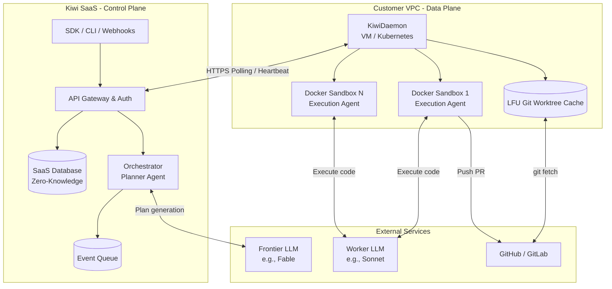

# RFC: Startup-First BYOC Platform Pivot

**Date:** 2026-07-16
**Status:** Proposed

## 1. Summary
This RFC proposes a strategic pivot of the Kiwi platform away from a heavy, enterprise-security-focused SaaS (with a complex Kanban UI) toward a lightweight, developer-native, BYOC (Bring Your Own Cloud) Execution Engine tailored for fast-moving startups. The new architecture emphasizes massive parallelization (The Swarm), zero-knowledge credential sharing, `git worktree` caching, and programmatic integrations (SDK/CLI).

## 2. Motivation
Startups face an infinite backlog but have limited runway and engineering headcount. Current AI copilots require too much human hand-holding, while existing cloud agents (like Vorflux) are rigid, opaque, and expensive. 

By pivoting to a BYOC model, we achieve two major goals:
1. **Cost & Privacy for Users:** Startups run the executing agents in their own AWS/GCP accounts, ensuring proprietary code never leaves their VPC and avoiding strict compliance audits.
2. **Zero Compute Overhead for Kiwi:** We act purely as the orchestration and planning layer, maintaining high margins.

## 3. Architecture Proposal (Control Plane / Data Plane)

The architecture splits into a central SaaS (Control Plane) and a localized agent runner (Data Plane).

### 3.1 High-Level Structure



### 3.2 Execution Flow
sequenceDiagram
    participant U as User (SDK/CLI/UI)
    box rgba(61, 91, 255, 0.1) Control Plane (Kiwi SaaS)
    participant API as API Gateway & Auth
    participant CP as Orchestrator (Go)
    participant Q as Event Queue
    end
    box rgba(200, 200, 200, 0.1) Data Plane (Customer BYOC)
    participant KD as KiwiDaemon (VM)
    participant SB as Sandbox (Docker)
    end
    participant LLM as LLM Provider (Fable/Sonnet)

    Note over U, API: 1. Setup & Registration
    U->>API: Add Provider Key (Encrypted in Browser via KD PubKey)
    U->>KD: Run `terraform apply` in AWS/GCP
    KD->>API: Boot & Self-Register (Sends PubKey)
    
    Note over U, Q: 2. Task Planning (The Swarm)
    U->>API: `kiwi submit "Fix issue #50"` (via CLI or Linear Webhook)
    API->>CP: Route Task
    CP->>LLM: Planner Agent (Fable) generates `worker-spec.json`
    LLM-->>CP: Returns chunked DAG of tasks, AGENT.md, deps
    CP->>Q: Enqueue `worker-spec.json` 
    
    Note over KD, SB: 3. Execution (Zero-Knowledge)
    KD->>API: HTTPS Heartbeat (Polling)
    API->>Q: Pop task
    API-->>KD: Send `worker-spec.json` (Includes Encrypted Keys)
    KD->>KD: Decrypt Keys in memory using Private Key
    KD->>KD: `git fetch` & `git worktree add /tmp/task-123`
    KD->>SB: Mount worktree into Docker Sandbox
    SB->>LLM: Execution Loop (Sonnet) writes code & tests
    SB-->>KD: Tests Pass -> PR Created
    KD->>KD: Unmount & `git worktree remove`
    KD->>API: Report Success
```

## 4. Technical Deep Dives

### 4.1 Zero-Knowledge Credential Management
To ensure the Control Plane never stores plaintext API keys or Git tokens:
* `KiwiDaemon` boots on a VM and generates an Ed25519 keypair, registering its Public Key with the CP.
* When a user inputs API keys into the SaaS UI, the browser encrypts them using the KD's Public Key.
* The CP stores and transmits ciphertext only.
* KD decrypts the payload in-memory during execution.

### 4.2 LFU Repository Caching (`git worktree`)
To avoid expensive network clones for parallel agents:
* KD maintains a base `bare` clone of the repository.
* When a task arrives, KD runs `git worktree add /tmp/task-123 main` (milliseconds latency, zero extra disk space).
* The Docker Sandbox mounts `-v /tmp/task-123:/workspace`.
* Post-execution, the worktree is destroyed via `git worktree remove`.

## 5. Phased Implementation Plan

### Phase 1: Data Plane Foundation (`kiwidaemon`)
* Scaffold `cmd/kiwidaemon` in Go.
* Implement Ed25519 cryptography and registration handshake.
* Implement HTTPS heartbeat polling for `worker-spec.json`.
* Implement `git worktree` isolation and Docker sandbox mounting.

### Phase 2: Control Plane Adaptations
* Implement the Event Queue for pending tasks.
* Update `kiwi-api` DB schema for zero-knowledge ciphertext storage.
* Expose endpoints for Fable planner triggers.

### Phase 3: Integration Layer (CLI & SDK)
* Build `kiwi login` and `kiwi submit` CLI.
* Implement `kiwi claude` local wrapper to route terminal commands to the Swarm.
* Publish minimal Node/Python SDK for CI/CD integrations.
* Build Linear Webhook receivers.

### Phase 4: Distribution
* Author Terraform/CloudFormation templates for 1-click customer deployment.

## 6. Drawbacks & Alternatives
* **Drawback:** BYOC requires the customer to manage a VM, which adds initial friction compared to a pure SaaS offering.
* **Mitigation:** Provide robust, copy-paste Terraform modules that handle VPC, VM, and networking automatically.
* **Alternative:** Fully hosted SaaS for execution. (Ruled out currently due to massive compute overhead and runway costs, but will be offered later as a premium tier).
