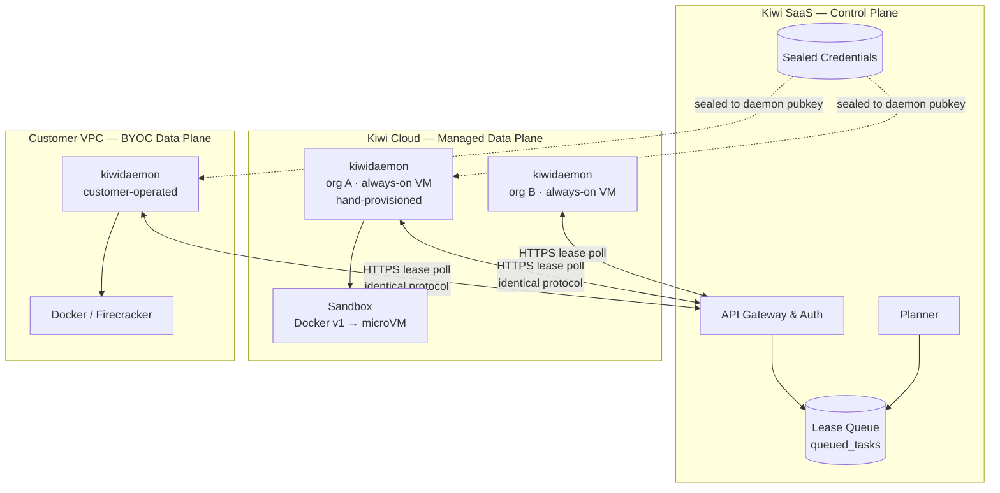

# RFC: Managed Execution Tier (Managed + BYOC)

**Date:** 2026-07-17
**Status:** Proposed
**Supersedes in part:** [RFC: Startup-First BYOC Platform Pivot](2026-07-16-startup-byoc-platform-rfc.md) §6 (tiering)
**Related:** [Architecture Review](../design/2026-07-16-byoc-architecture-review.md) · [Phased Plan](../PHASED_PLAN.md)

## 1. Summary

This RFC adds a **fully-managed execution tier** alongside BYOC, in which Kiwi operates the Data Plane in Kiwi's own cloud account.

The central claim is that this costs us very little architecturally, because the BYOC design already made the right call: the Data Plane **pulls** work over HTTPS. Nothing in that protocol cares who owns the machine. Managed is therefore not a second architecture — it is *"Kiwi runs the daemon for you."* One binary, one protocol, two operators.

This also **inverts the tiering** proposed in the BYOC RFC §6, which framed fully-hosted execution as a later *premium* tier. It should be the **default entry path**, with BYOC as the tier customers *graduate to* for compliance or cost.

## 2. Motivation

### 2.1 Friction, not capability, is the adoption problem

The BYOC RFC §2 targets startups with "limited runway and engineering headcount," and its own §6 concedes that "BYOC requires the customer to manage a VM, which adds initial friction." Those two statements are in tension. We picked the highest-friction delivery model for the least patient buyer. Nobody `terraform apply`s to evaluate a tool.

Managed makes first value look like:

```bash
npm i kiwi && kiwi submit "Fix issue #50"
```

with no AWS account, no VM, no Terraform.

### 2.2 BYOC is not a moat

The competitive premise of the BYOC RFC has not held up. [E2B ships BYOC today](https://e2b.dev/docs/byoc) — sandboxes deployed into the customer's own AWS/GCP VPC, internal load balancer, VPC peering, with sandbox traffic and logs never touching E2B's infrastructure. Daytona offers bring-your-own-compute at enterprise tier; Modal offers self-hosted for enterprise. **Hybrid managed + BYOC is table stakes in this category, not differentiation.**

What those platforms do *not* do is the layer above: decompose an issue into a worker DAG and run a swarm against it. They hand you a sandbox and say "bring your own agent." **Kiwi's differentiation is the planner and the swarm — not the sandbox, and not BYOC.** Our tiering should stop pretending otherwise.

### 2.3 This is re-sequencing, not a pivot

The BYOC RFC §6 already contemplated fully-hosted execution. This RFC pulls that forward and re-tiers it. The Phase 1–3 BYOC work is not wasted; it becomes the top of the ladder rather than the bottom.

## 3. Architecture

### 3.1 The invariant: one daemon, two operators

This is the load-bearing design constraint of this RFC:

> **The daemon does not know whether it is managed or BYOC.** It generates keypairs, registers, polls for work, executes, reports. Who provisioned the VM is not its concern.

This mirrors GitHub Actions hosted vs self-hosted runners, Buildkite hosted vs self-hosted agents, and Terraform Cloud agents — all of which ship *one* runner and vary only who operates it. Our architecture review already observed that the pull model follows this pattern; this RFC takes the rest of the pattern too.

**The primary risk to this RFC is forking a managed-only execution path.** If managed grows its own scheduler, its own protocol, or its own daemon, we own two data planes and the tier ladder stops working. Any PR that special-cases managed inside the daemon should be treated as a design failure.



### 3.2 Managed daemons are per-org, not a shared pool

A shared multi-tenant daemon pool is tempting and wrong. Credentials are sealed to a *daemon's* X25519 public key; a daemon serving many orgs would hold the ability to decrypt many orgs' credentials, collapsing the credential model into a single blast radius.

**Managed runs one daemon per org.** This preserves every existing invariant without a protocol change:

- one daemon ⇒ one org ⇒ one keypair; credential sealing is unchanged
- `org_id` on every task-scoped row is unchanged
- the lease queue is already per-org (`LeaseNextTask(ctx, orgID, …)`)

### 3.2.1 v1 is always-on and hand-provisioned. Do not build an autoscaler.

An earlier draft of this RFC said "autoscaled to zero." **That was wrong, and it is worth saying why, because the mistake is instructive.**

**The daemon is a stateful pet by design, and that is a feature.** It keeps a bare clone on local disk (`-cache-dir`), materializes `git worktree`s from it, and persists its keypairs at `~/.kiwi/daemon.key`. The entire performance claim of this architecture — worktree add in milliseconds instead of a network clone — **depends on that cache being warm on a machine that stays up.**

Scale-to-zero deletes exactly that. Every cold start re-clones the repo, discarding the reason `pkg/gitcache` exists, and pays 30–60s of VM boot before the first task — in the tier whose entire selling point is zero friction.

**So for v1: one small always-on VM per customer, provisioned by hand.** At ten customers that is roughly $50–200/month — noise against the engineer-days of building an autoscaler and the ongoing cost of operating one. Warm cache, no cold start, identical binary, credential model untouched.

This is not a compromise. Hand-provisioning ten VMs is the correct engineering decision at ten customers.

### 3.2.2 When this expires

In this order. Each step is forced by a real customer, not anticipated:

1. **One customer's parallelism exceeds one VM.** → N daemons per org. The lease queue already supports this: `LeaseNextTask(ctx, orgID, leasedBy, ttl)` takes a `leasedBy`, so multiple daemons can lease one org's queue today. Architecture review §5.2 makes the same point — it is nearly free.
2. **Idle VM cost stops being noise.** → *then* autoscaling, or packing daemons onto shared hosts.
3. **Density forces shared hosts.** → now Org A and Org B share a kernel and per-sandbox microVM isolation becomes structural, not optional (§4.2).

Cross-org isolation while one org owns its whole VM is enforced by the VM boundary. From step 3 it moves down to the sandbox — but see §4.2 for why that does **not** make Docker acceptable in managed v1.

## 4. Technical Deep Dives

### 4.1 Zero-knowledge does not survive managed mode — say so plainly

In BYOC, Kiwi *cannot* read customer credentials: they are sealed to a daemon key that only the customer's VM holds. **In managed mode we operate the machine that holds the private key, so we can.** The X25519 sealing still protects credentials in transit and at rest, but the zero-knowledge property is gone.

This is normal — it is exactly the trust posture of E2B, Modal, and every other managed platform — but it must not be papered over. Docs and marketing must scope the zero-knowledge claim to BYOC only. Claiming it for managed would be false, and it is the kind of false claim that ends a company when it surfaces.

Handled honestly, it becomes the ladder's best selling point:

> *Managed: we hold your keys, like any SaaS. BYOC: we can't. Same product, one flag.*

### 4.2 Multi-tenancy raises the isolation bar — this is the real new work

In BYOC we can be relaxed about isolation: it is the customer's code, in the customer's VPC, and the blast radius is their own account. Managed changes this, but **not** in the way an earlier draft of this section claimed.

With per-org VMs (§3.2.1), Org A's code does *not* run next to Org B's — the VM is the tenant boundary, as in BYOC. It is tempting to conclude Docker is therefore fine in managed v1. **It is not, and the reason is the one thing BYOC never had:**

> In BYOC, a container escape lands the attacker in **the customer's own account** — their machine, their data, their problem. In managed, the identical escape lands them in **our production network**, with whatever that VM's identity and reachability grant them. Same escape, categorically different blast radius.

So the cross-tenant argument is deferred by per-org VMs; the escape-into-our-infrastructure argument is not, and it arrives with the first real customer. Three things follow:

1. **Hardware-level isolation.** The current sandbox (`USE_DOCKER=true`, `pkg/sandbox`) is a shared-kernel container running untrusted model-generated code on our hardware. Managed wants a microVM boundary — Firecracker (dedicated kernel per sandbox, KVM-enforced, ~5MB overhead, ~125ms cold start) or equivalent. Structurally mandatory from §3.2.2 step 3; strongly wanted well before that.
   **If v1 ships on Docker as an interim,** then every daemon VM must be treated as already hostile: minimal instance identity, no ambient cloud credentials, network-segmented from the control plane and from other daemon VMs, and reachable only outbound. That is the price of deferring, and it should be a deliberate decision rather than an oversight.
2. **Default-deny egress + credential-injecting proxy.** Already argued in architecture review §3.1/§3.2 and deferred; managed makes it non-negotiable. The sandbox must never hold the LLM key — the daemon runs a local proxy that injects auth headers, and egress is allowlisted to the model endpoint and VCS only. `pkg/tunnel` is a head start.
3. **Abuse controls.** Cryptomining, resource exhaustion, and egress abuse are managed-only problems. Quotas plus detection.

**We should not build our own isolation runtime.** Modal's "1 million sandboxes in under a minute" is frequently misread as a sandbox-runtime achievement; [their own writeup](https://modal.com/blog/scaling-to-1-million-concurrent-sandboxes-in-seconds) never names their isolation technology and attributes every win to the control plane — removing central bottlenecks, async state via Redis streams, in-memory load balancing, and `rtnl` lock contention in the kernel. The isolation layer is commoditized (Firecracker is ~50k lines of Rust maintained by AWS, with upstream `userfaultfd` snapshot/restore in 5–30ms). Building down into it spends scarce engineering on the one layer our competitors give away.

### 4.3 Managed dissolves the planner/privacy contradiction

Architecture review §2 identifies a blocker: the Planner runs in the Control Plane and needs repo context, while `kiwi submit` zips the working directory and uploads it (`cmd/kiwi/submit.go:72`) — so "code never leaves your VPC" is false as built.

Tiering resolves it, using the same trick as the daemon:

- **Managed:** the code is already on Kiwi infrastructure by definition. A Control-Plane planner costs nothing in privacy. Keep it.
- **BYOC:** the planner moves daemon-side, calling the frontier model with a sealed planning key and returning only `worker-spec.json` metadata to the CP. This is Option A from the review.

**Same planner code, deployed in two places** — mirroring §3.1. The contradiction was an artifact of assuming one deployment model. It does not block this RFC; it becomes a BYOC-tier requirement.

### 4.4 Economics: the margin thesis changes

BYOC RFC §2.2 promises "Zero Compute Overhead for Kiwi, maintaining high margins." **Managed makes compute a real COGS line**, and agent workloads are long-running — minutes to hours, not sub-second bursts.

Two consequences:

1. **Quotas become load-bearing.** `org_limits` already exists in `migrations/0001` (`max_concurrent_jobs`, `max_budget_per_job`, `max_budget_per_month`, `max_workers_per_job`, `task_timeout_seconds`, `max_sandbox_disk_mb`) and monthly budget is partly enforced (`pkg/auth/limits.go`, `pkg/orchestrator/server.go:508`). Managed requires per-job and concurrency caps enforced too, before "50 parallel agents overnight" meets a runaway loop on our bill.
2. **Idle reclaim is margin, not a benchmark stunt.** Coding agents are blocked on model inference for most of their wall-clock life. In BYOC the customer eats that idle; **in managed we do.** Hibernate-on-idle (snapshot + stop, restore in tens of ms) is therefore a direct COGS lever and should be scoped into managed from the start rather than treated as an optimization.

### 4.5 Tiering

| | Managed | BYOC |
| :--- | :--- | :--- |
| Operator | Kiwi | Customer |
| Onboarding | `kiwi submit` | Terraform + VM |
| Credentials | Kiwi can decrypt | Kiwi cannot |
| Planner | Control Plane | Daemon-side |
| Isolation | Firecracker (required) | Customer's choice |
| Customer pays | Compute + orchestration | Orchestration only |
| Position | **Default entry** | **Graduation** |

Entry is a bounded free tier (N agent-minutes/month), then usage-based. BYOC is cheaper for the customer *and* for us — it is a legitimate upsell, not a downgrade, and "move to your own cloud when you outgrow trusting us" is a stronger story than a toll gate.

## 5. Phased Implementation Plan

### Phase 0 — Close the seam (blocker, shared by both tiers)
Tracked in **#115**. The Data Plane and Control Plane are not connected: no `/api/v1/daemon/heartbeat` handler exists, `LeaseNextTask` has no production caller, `crypto.OpenSealed` is never called, and the daemon runs a placeholder `echo` instead of an agent.

**Neither tier ships until one task flows end-to-end.** This is the shared spine — build it once and managed becomes weeks of work rather than a quarter.

### Phase M1 — Managed daemon operation
* One always-on daemon VM per org in Kiwi's account, **hand-provisioned. No autoscaler** (§3.2.1).
* Daemon VMs hardened as untrusted: minimal instance identity, no ambient cloud credentials, network-segmented, outbound-only (§4.2).
* Kiwi-side key custody and registration (join tokens issued internally rather than to a customer).
* Tier flag on the org; `kiwi submit` works with no setup.

### Phase M2 — Multi-tenant isolation
* Firecracker (or equivalent microVM) sandbox driver behind the existing `pkg/sandbox` interface.
* Default-deny egress + credential-injecting proxy; sandbox never holds the LLM key.
* Abuse and resource-exhaustion controls.

### Phase M3 — Metering & quotas
* Enforce `org_limits` per-job and concurrency, not just monthly budget.
* Cost attribution per job/agent; usage-based billing.
* Hibernate-on-idle reclaim.

### Phase M4 — The ladder
* BYOC daemon-side planner (§4.3), completing the privacy promise for that tier.
* `kiwi byoc migrate` — same org, same tasks, customer-operated daemon.

## 6. Drawbacks & Alternatives

**Drawback: the margin thesis dies.** Managed is a real cost center (§4.4). Accepted: friction is currently costing us all the revenue, and there is none to protect.

**Drawback: zero-knowledge does not hold in managed (§4.1).** Mitigated by honest scoping and by making BYOC the answer for customers who need it.

**Drawback: two data planes to operate before one works.** This is the real risk. Mitigated by Phase 0 and by the §3.1 invariant — if managed ever forks the daemon, this drawback becomes fatal.

**Alternative: stay BYOC-only.** Rejected. It is not a moat (§2.2), and its friction targets exactly the buyer least able to absorb it (§2.1).

**Alternative: build our own sandbox runtime to compete on sandboxes-per-second.** Rejected (§4.2). The headline number is a control-plane achievement, the isolation layer is commoditized, and — decisively — sandboxes-per-second is a *multi-tenant aggregate* metric. Under BYOC it is unsellable, because a single customer will never run a million sandboxes in their own account; they will hit their cloud quota first.

**Alternative: rent the managed backend (E2B/Modal) instead of operating it.** Genuinely open, and worth costing before Phase M1. Wrapping an existing sandbox provider could ship managed in weeks and validate demand before we own capacity planning, abuse, and on-call; we would insource later if margins demand it. The cost is a dependency on a company that may move up-stack into orchestration. **Recommend a spike here before committing to M2.**

## 7. Open Questions

1. **Buy vs. build for managed compute** (§6, final alternative) — decide before M2.
2. **At-least-once delivery ⇒ duplicate PRs.** The lease queue redelivers on crash; without idempotency at the "create PR" step, retries open duplicate PRs. Sharper in managed, where we are blamed for the duplicates.
3. **Protocol versioning.** BYOC customers control their upgrade cadence; managed daemons we upgrade ourselves. The heartbeat and `worker-spec.json` need an explicit schema version and a min-supported check, or the tier ladder strands BYOC daemons on the first breaking change.
4. **Free-tier abuse.** A zero-friction managed tier that runs model-generated code on our hardware is an attractive target for cryptomining. Bound it before launch, not after.
